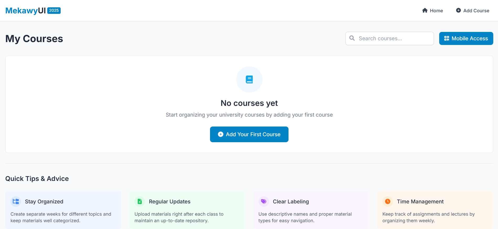
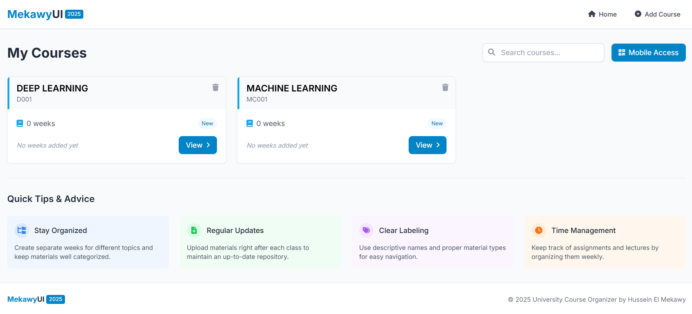
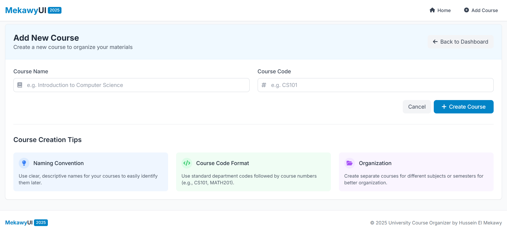
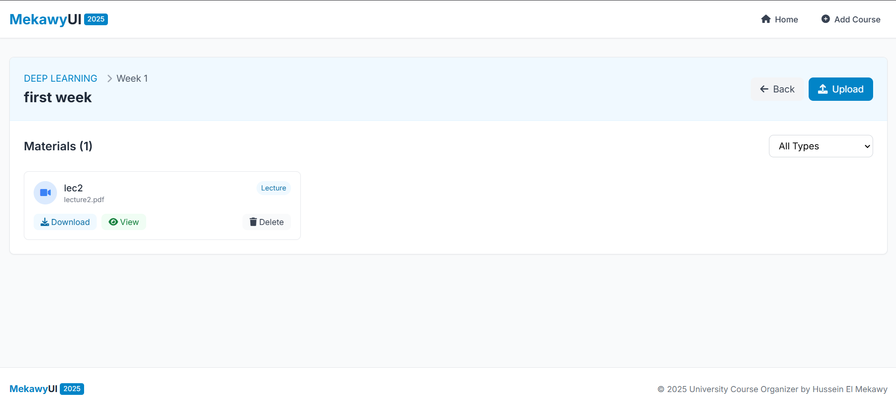
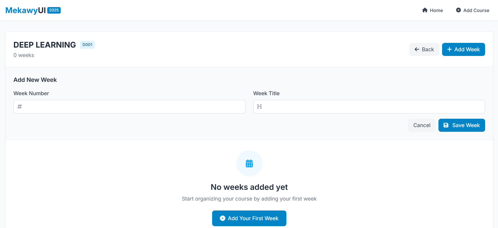
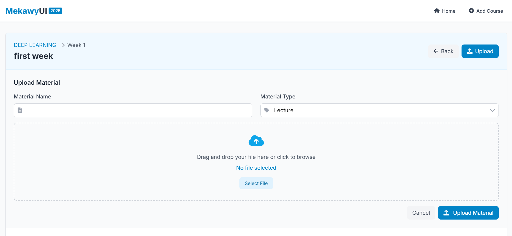

# 🎓 University Course Organizer

> An Elegant & Powerful Web Application to Simplify Your Academic Life


---

## 🌟 Key Features

- 📚 **Intuitive Course Management:** Easily manage all your courses, materials, and deadlines.
- 📅 **Dynamic Schedule Builder:** Visually arrange your academic timetable.
- 🎯 **Progress Insights:** Keep track of your academic progress with detailed analytics.
- 🔐 **Robust Security:** Secure authentication and data protection.
- 📱 **Responsive Design:** Seamlessly use the app across all devices.

---

## 🚀 Quick Start

Get started instantly with just a few commands:

```bash
git clone <https://github.com/hossmekawy/univ-arrange-webapp.git>
cd univ-arrange-webapp
run setup_and_run.bat
# Wait for 10 seconds and your app will be ready!
```

---

## 🛠️ Built With

- **Python & Flask:** Scalable and efficient backend.
- **JSON Data:** Lightweight data handling.
- **HTML/CSS/JavaScript:** Rich, interactive frontend.
- **Bootstrap:** Responsive and sleek UI components.

---

## 📸 Application Preview

| Dashboard & Home Index | My Courses Overview |
| ---------------------- | ------------------- |
|  |  |

| Add New Course | Material List |
| -------------- | ------------- |
|  |  |

| Insert Course Weeks | Upload Material |
| ------------------- | --------------- |
|  |  |

---

## ⚡ Advanced Course Management

- Effortlessly create, update, and remove courses.
- Easily upload and organize course materials.
- Stay ahead by tracking assignments, quizzes, and important deadlines.
- Add and manage weekly course content and materials.
- Quickly download or delete course materials.
- Automatically structured file management for courses and weekly materials.

---

## 🔌 API Reference

Simple RESTful API for seamless integration:

```python
GET /api/courses        # Retrieve all courses
POST /api/courses       # Add a new course
PUT /api/courses/:id    # Edit existing course
DELETE /api/courses/:id # Remove a course
```

---

## 📱 Mobile Access & QR Code

- Easy mobile access with generated QR code for quick connection.
- Supports direct file downloads on mobile devices.

---

## 🔒 Security & Authentication

- Unique session-based authentication.
- Secure data storage and file handling.

---

## 📜 License

Licensed under **MIT License**. You're free to adapt, modify, and use the project as you wish!

---

Crafted with ❤️ & care for students by students.

